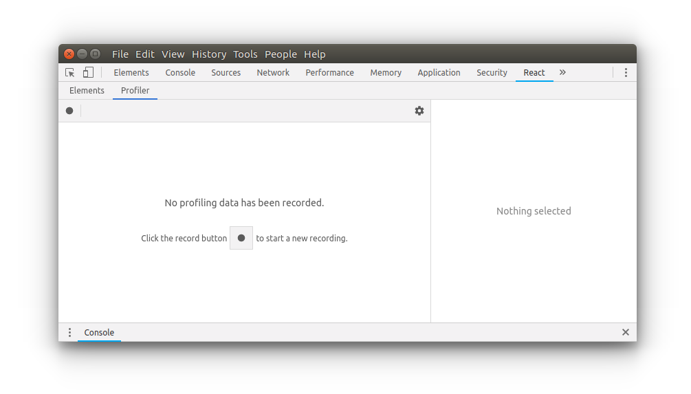
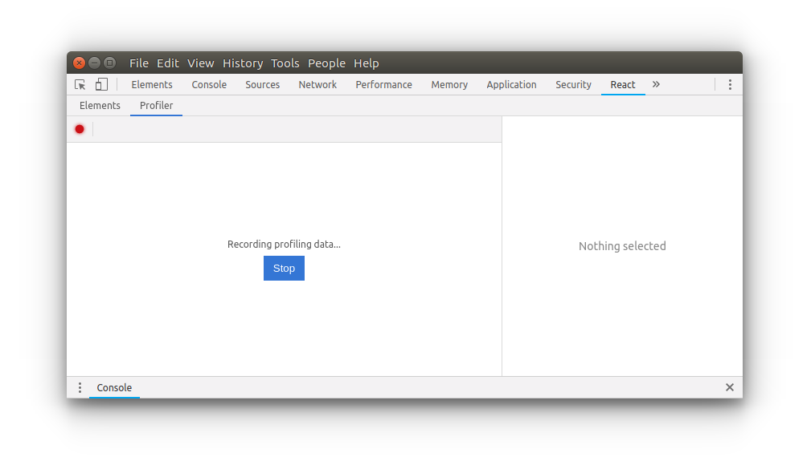
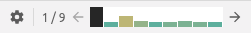
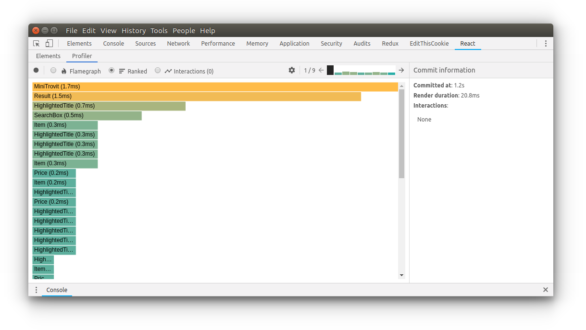
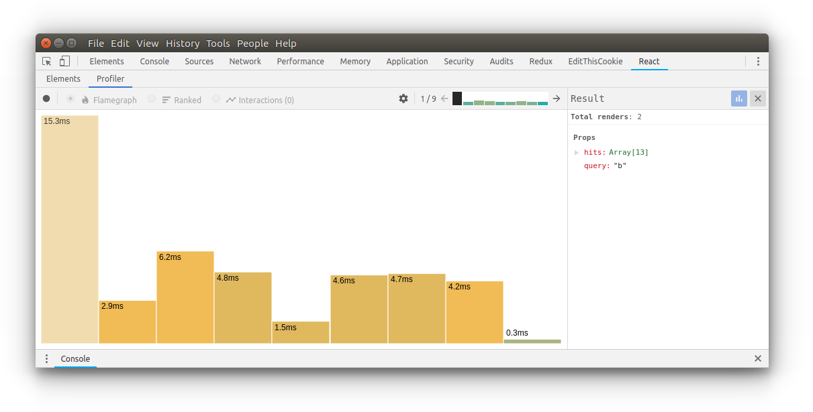
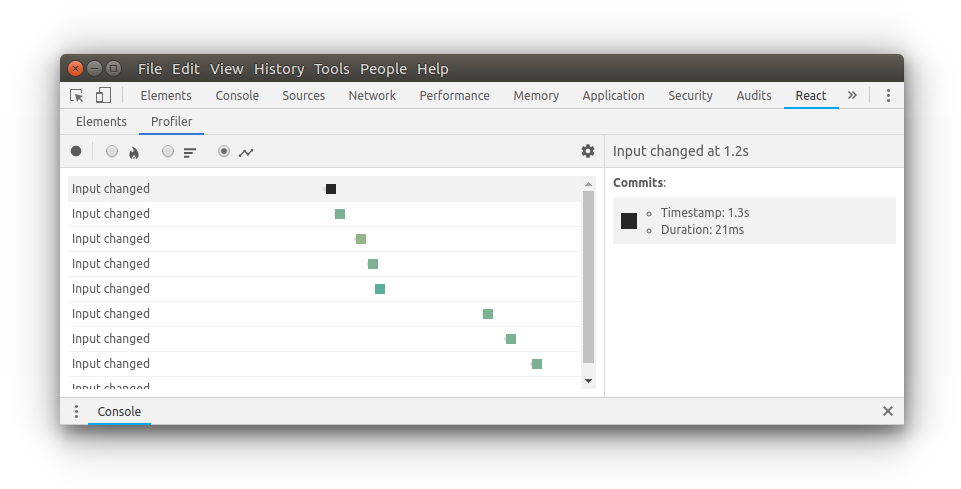

# Research notes

<!-- TOC -->

- [Quick concepts](#quick-concepts)
- [Access & usage](#access--usage)
- [Reading data](#reading-data)
- [Resources](#resources)

<!-- /TOC -->

## Quick concepts

- Implemented since `react-dom@16.5`
- Needs `ReactDevTools` plugin in Chrome
-
- Collects timing information abpout each component that is rendered in order to identify performance bottlenecks in React applications.
- In the future will be fully compatible with "time-slicing" and "suspense".

## Access & usage

Open `Chrome dev tools" > React > Profiler`

Press the record button to start profiling any interaction. Once you're done, just stop recording.

## Reading data

Conceptually, React works in two phases:

- **Render:** determine the changes that need to be made on the DOM. React calls the "render()" method and compares the result to the previous render.
- **Commit:** apply the changes. Is when React inserts, updates and removes DOM nodes. Also calls this two lifecycle methods: `componentDidMount()` and `componentDidUpdate()`

### Commits bar

Devtools groups the recorded performance info by commit in a bar near the top right of the profiler.

- Each bar represents a single react commit.
- The color and height of each bar represents how long the commit took to render.
  - Longer render: tall and yellow bars.
  - Shorter render: short and blue bars.

You can also filter the commits. It's helpful for long profiling.

- **Show native elements:** shows html native elements & react components.
- **Hide commits below (number):** shows commits

### Flame chart

The flamechart view represents the state of the application for a particular React commit.

- Each bar respresents a component (Input, Result, Hit, etc)
- The width and color represents how long took the component and its childs to render.

  - **Width:** how long took the component (and its children) to render when they last rendered. The wider the component, the longer took to render.
  - **Color:** time spent of the component (and its children) as to render in the current commit.

    - Yellow components took more time.
    - Blue components took less time.
    - Gray components did not render at all during the commit.

TODO: not clear enough, at least for me.

### Ranked chart

Represents a single commit. Each bar shown in the chart is a React component (SearchBox, Results, Hit, etc.). The component is ordered from the longest to render (top) to the shortest (bottom).

### Component chart

Useful to see how many times a single component was rendered. Each bar represents its render time in a single commit.

The color and height of each bar corresponds to how long the component took to render relative to other components in a particular commit.

### Interactions

React recently added another experimental API to track the cause of an update.
Each row represents an interaction that was traced. The colored dots along the row represent commits that were related to that interaction.

## Resources

- Introducing the React Profiler (Reactjs.org): https://reactjs.org/blog/2018/09/10/introducing-the-react-profiler.html
- Profiling components with Devtools profiler (Reactjs.org): https://reactjs.org/docs/optimizing-performance.html#profiling-components-with-the-devtools-profiler
- React Devtools Profiler (Elijah Manor): https://elijahmanor.com/react-devtools-profiler/
- Interaction Tracing with react (Bvaugn Gist): https://gist.github.com/bvaughn/8de925562903afd2e7a12554adcdda16
- Use the New Profiler in React Developer Tools to Generate Flame Charts and Interactions (egghead.io):https://egghead.io/lessons/react-use-the-new-profiler-in-react-developer-tools-to-generate-flame-charts-and-interactions
